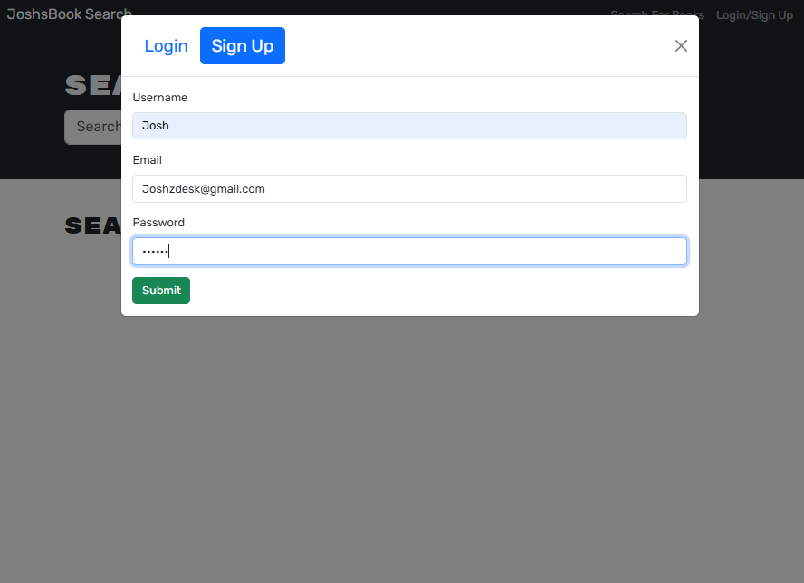

# Josh's Book Search

Josh's Book Search is a full-stack MERN application that allows users to search for books using the Google Books API, save their favorite books, and manage their saved list through a clean user interface.

---

## 🚀 Tech Stack

- **Frontend:** React, Vite, Apollo Client, Bootstrap  
- **Backend:** Express, Apollo Server, GraphQL, Mongoose  
- **Database:** MongoDB Atlas  
- **Auth:** JWT

---

## 📸 Screenshots

### Home Page (Search)


### Saved Books


### Login/Signup


---

## 🔧 Installation

1. **Clone the repo**  
   ```bash
   git clone https://github.com/joshsdesk/JoshsBookSearch.git
   ```

2. **Install dependencies**  
   ```bash
   cd server
   npm install

   cd ../client
   npm install
   ```

3. **Set up environment variables**  
   In `server/.env`:
   ```
   MONGODB_URI=<your MongoDB Atlas URI>
   JWT_SECRET_KEY=<your secret>
   ```

4. **Build and run the server**  
   ```bash
   cd server
   npm run build
   npm run start
   ```

5. **Start the client**  
   ```bash
   cd ../client
   npm run dev
   ```

---

## 🌐 Live Deployment

Coming soon via [Render](https://render.com)

---

## 📬 Contact

Created by Josh — proudly built from the ground up.

